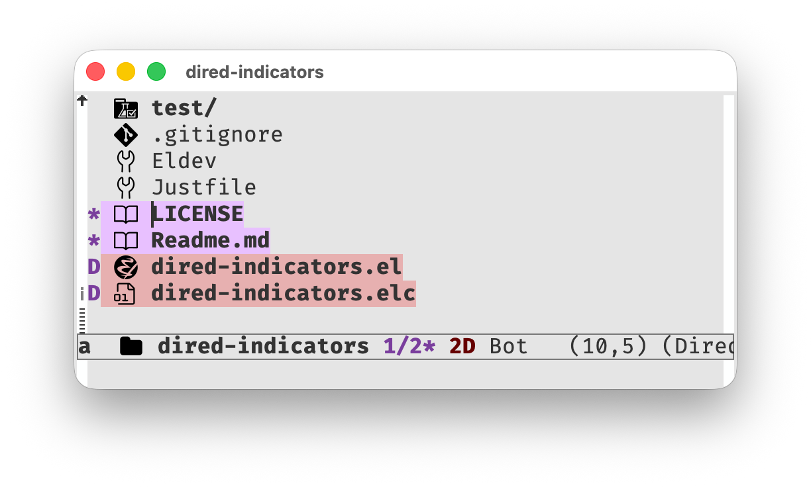

# dired-indicators

`dired-indicators` adds mode line indicators in dired-mode for:

- marked files
- files flagged for deletion
- the current item index when point is on one of those entries



(kinda similar to what is available in [dired+](https://www.emacswiki.org/emacs/DiredPlus))

## Installation

With `straight.el` and `use-package`:

```emacs-lisp
(use-package dired-indicators
  :straight (:host github :repo "vderyagin/dired-indicators")
  :after dired
  :hook (dired-mode . dired-indicators-mode))
```

## Customization variables & faces

- `dired-indicators-show-marked`
- `dired-indicators-show-flagged`
- `dired-indicators-marked-face`
- `dired-indicators-flagged-face`
